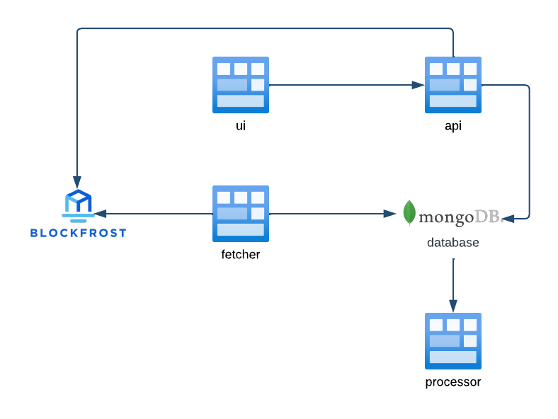

# 🌿 Ecosystem Marketplace App
[](https://github.com/Vaka-Consulting/ecosystem-marketplace-app/actions/workflows/npm-ci.yml)

## 📝 Description  
The **Ecosystem Marketplace App** is a platform designed to connect NFT buyers and sellers within the **Cardano network** 🌐. It provides a seamless experience for users to trade NFTs efficiently and securely.  



---

## 🧩 Modules  

Each module has its own detailed documentation in its directory. Click the links below to learn more:  

### **Database (db)** 🗄️  
- A **MongoDB** instance that stores all the application data.   
- Can be replaced with **MongoDB Atlas** or any other preferred database.  

### **User Interface (ui)** 🖥️  ([doc](packages/marketplace-ui/README.md)  )
- Handles the frontend and user interface of the marketplace.  
- Provides an intuitive and user-friendly experience.  

### **API (api)** 📡  ([doc](packages/marketplace-graphql-api/README.md))
- Contains **GraphQL API endpoints**.  
- Fetches and serves backend data from the MongoDB database.  

### **Processor** ⚙️  ([doc](packages/marketplace-processor/README.md))
- Runs on a **cron interval** to verify transactions.  
- Utilizes the **Blockfrost API** for transaction verification.  

### **Fetcher** 🔄  ([doc](packages/policy-assetfetcher/README.md))
- Fetches policy assets from Blockfrost API.  
- Automatically saves data to database on Docker startup.  
---

## 🛠️ Local Development  

The application supports local development using **Docker**, enabling real-time updates for code changes. Currently, this feature is available for the **UI package**.  

### **Start the Development Server** 🚀  
```bash
docker compose -f development.yml up
```

### **Stop the Development Server** 🛑  
```bash
docker compose -f development.yml down
```

---


## 🔗 Smart Contract Deployment  

Before deploying the Ecosystem Marketplace App, you **must first deploy the smart contract** to the Cardano network. The contract logic and deployment scripts are hosted in a separate repository:  

### **Steps to Deploy the Smart Contract**  

1. **Build and Deploy the Contract**:  
   - Follow the deployment instructions in the [ecosystem-marketplace-contracts repository](https://github.com/Vaka-Consulting/ecosystem-marketplace-contracts.git) to compile and deploy the contract. 

2. **Retrieve Contract Configuration**:  
   - After deployment, **note these values** from the deployment logs:  
     - `protocol_owner_address`  (Owner address who deployed this marketplace)
     - `script_address`  (This is the marketplace address)  
     - `fee_oracle_address` (This is the oracle address of marketplace)  
     - `fee_oracle_asset`  (Can be extracted feeOracleAddress by checking its only one asset and it does not have asset name just the policy id)
     - `fee_percentage`  (Can be extracted feeOracleAddress by checking its only one asset and it does not have asset name just the policy id)

4. **Update MongoDB Configuration**:  
   Modify `init-mongo.js` with your contract's values:  
   ```javascript
   db.app_config.insertMany([
     {
       "name": "marketplace-config",
       "protocol_owner_address": "<YOUR_PROTOCOL_OWNER_ADDRESS>", // From deployment output (`owner_address` in marketplace.config.json)
       "script_address": "<YOUR_DEPLOYED_SCRIPT_ADDRESS>", // From deployment output (`marketplaceAddress`)
       "fee_oracle_address": "<YOUR_FEE_ORACLE_ADDRESS>", // From deployment output (`feeOracleAddress`)
       "fee_oracle_asset": "<YOUR_FEE_ORACLE_ASSET_ID>", // From deployment output (policy ID of the only asset in feeOracleAddress)
       "token_asset": "lovelace", // Or for custom currency "<policy_id><token_hash>" from marketplace.config.json
       "fee_percentage": 2.5, // `feeNumerator` from marketplace.config.json, divided by 10000 (e.g., 250000 becomes 2.5)
     }
   ]);
   ```

❗ **Critical**:  
- Values must match your actual contract deployment output  
- Recreate MongoDB containers after updating `init-mongo.js` using `rm -rf ./data`

---

This places the MongoDB configuration instructions immediately after contract deployment steps, ensuring logical flow.

---  

## 🚀 Installation  

Follow these steps to set up the **Ecosystem Marketplace App** locally:  

1. **Clone the Repository** 📂  
   ```bash
   git clone https://github.com/Vaka-Consulting/ecosystem-marketplace-app
   ```

2. **Navigate to the Project Directory** 📁  
   ```bash
   cd ecosystem-marketplace-app
   ```

3. **Configure the `.env` File** ⚙️  
   ```bash
   cp sample.env .env
   ```
   Check `.env` file for more details on configuring env values.

4. **Build Docker Containers** 🏗️  
   ```bash
   docker compose build
   ```

5. **Start Docker Containers** ⬆️  
   ```bash
   docker compose up
   ```

6. **Stop Docker Containers** ⬇️  
   ```bash
   docker compose down
   ```

---

## 🤝 Contributing  
We welcome contributions! If you'd like to contribute to the project, please follow the guidelines in the [CONTRIBUTING.md](CONTRIBUTING.md) file.  

## 📜 License  
This project is licensed under the **MIT License**. See the [LICENSE](LICENSE) file for more details.  

---

Enjoy building and trading on the **Ecosystem Marketplace App**! 🎉🚀